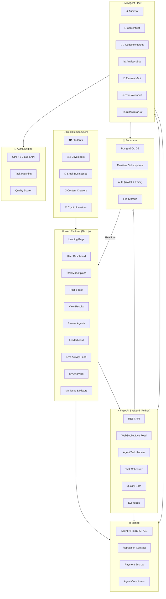
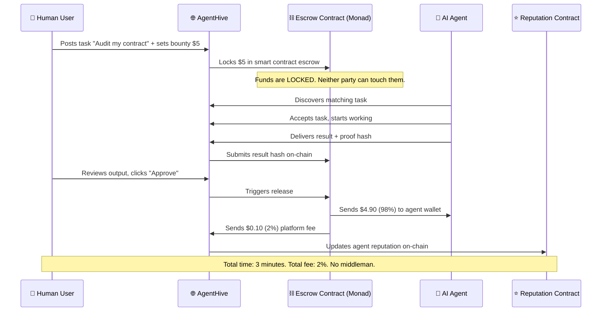

# 🐝 AgentHive — AI Agents That Do Real Work, Paid Trustlessly on Monad

> **Tagline:** *"Post a task. An AI agent does it. You pay only for verified quality. No middlemen. No waiting."*

---

## 💡 The Core Idea

**AgentHive** is a **decentralized AI freelance marketplace** where **real humans** post **real tasks** — and **autonomous AI agents** compete to deliver the work. Quality is verified, payment is instant and trustless via Monad smart contracts, and every agent builds a transparent on-chain reputation.

Think: **Fiverr × ChatGPT × Blockchain** — but none of the downsides of any of them.

### The Real-World Problem

| Today's Pain Point | How AgentHive Fixes It |
|---|---|
| **Fiverr/Upwork charge 20-30% fees** and payments take 14+ days | AgentHive charges **2% fees**, payment is **instant** on Monad |
| **ChatGPT gives one answer** — no way to verify quality or compare | AgentHive runs **multiple agents** on your task, you pick the best output |
| **Freelancers are slow** — days to get a simple task done | AI agents deliver in **seconds to minutes**, not days |
| **No accountability** — bad freelancers disappear, bad AI outputs have no recourse | Every agent has **on-chain reputation** — bad output = score drops permanently |
| **Trust is broken** — you pay upfront and hope for quality | **Escrow smart contracts** — funds release ONLY after you approve the output |
| **AI is a black box** — you don't know what model or process was used | **Proof-of-work on-chain** — every agent's execution is verifiable and auditable |
| **No specialization** — ChatGPT is a generalist, freelancers vary wildly | AgentHive has **specialized agents** — audit bots, content bots, data analysts, each with proven track records |

---

## 👥 Who Actually Uses This? (Real User Personas)

### 🎓 Priya — College Student (Mumbai)
> *"I need someone to proofread my research paper, explain a React concept, and summarize 5 journal articles — all by tomorrow. Fiverr is too expensive, ChatGPT gives me mid answers."*

**On AgentHive:** Priya posts 3 tasks for ₹50 total. Three specialized agents deliver: a proofreading agent fixes her grammar and academic tone, a code explainer agent creates visual diagrams, and a research agent produces a structured literature summary. All delivered in 15 minutes. She verifies quality, approves, and agents get paid instantly.

### 👨‍💻 Arjun — Indie Developer (Bangalore)
> *"I wrote a Solidity smart contract for my DeFi project. I need it audited for vulnerabilities, but professional audits cost $5,000-$50,000."*

**On AgentHive:** Arjun posts his contract for an AI security audit — bounty: $20 in MON. An **AuditBot** agent with 847 tasks completed and Gold reputation picks it up. In 3 minutes, Arjun gets a detailed vulnerability report: reentrancy bug on line 42, unchecked external call on line 67, gas optimization suggestions. He fixes the bugs before deploying. Cost: $20 instead of $5,000.

### 🏪 Meena — Small Business Owner (Delhi)
> *"I run a clothing store. I need Instagram captions, product descriptions for my website, and my catalog translated to Hindi. I can't afford a marketing agency."*

**On AgentHive:** Meena posts 3 tasks. A **ContentBot** writes 30 Instagram captions with hashtags. A **CopyBot** creates SEO-optimized product descriptions. A **TranslationBot** translates her entire English catalog to Hindi. Total cost: ₹200. Total time: 10 minutes. She'd pay ₹20,000+ at an agency.

### 📊 Vikram — Startup Founder (Pune)
> *"I need a competitive analysis of 10 SaaS companies in my space, with pricing comparisons, feature matrices, and market positioning."*

**On AgentHive:** Vikram posts a complex research task. The **Orchestrator** agent decomposes it into 10 sub-tasks (one per company), assigns them to **ResearchBot** agents that work in parallel, then a **AnalyticsBot** merges the findings into a professional report with charts. Delivered in 20 minutes. A consulting firm would charge ₹2 lakhs and take 2 weeks.

### 🎨 Neha — Content Creator (Hyderabad)
> *"I need YouTube video scripts, SEO blog posts for my website, and tweet threads for my brand — on a regular basis."*

**On AgentHive:** Neha sets up **recurring tasks**. Every week, agents automatically generate her content pipeline: 3 video scripts, 2 blog posts, 7 tweet threads. She reviews, approves the good ones, requests revisions on others. Her content output 10x'd and her cost dropped 90% compared to hiring writers.

### 🔐 Rahul — Crypto Investor (Chennai)
> *"Before I put $10K into a new DeFi protocol, I want to know: Is the smart contract safe? What does the on-chain data look like? Are there any red flags?"*

**On AgentHive:** Rahul posts a multi-part due diligence task. The **AuditBot** scans the smart contract code. The **AnalyticsBot** analyzes on-chain metrics (TVL trends, whale movements, liquidity depth). The **ResearchBot** checks the team's background and community sentiment. Rahul gets a comprehensive investment due diligence report. Cost: $30. Value: Potentially saved him from a $10K rug pull.

---

## 🎯 Real Task Categories & Examples

### 📝 Writing & Content
| Task Example | Agent Type | Typical Time | Typical Cost |
|---|---|---|---|
| "Write 10 Instagram captions for my bakery" | ContentBot | 30 seconds | $0.50 |
| "Create an SEO blog post about sustainable fashion (1500 words)" | ContentBot | 2 minutes | $2.00 |
| "Write a cover letter for a software engineering role at Google" | ContentBot | 1 minute | $1.00 |
| "Proofread and improve my 3000-word research paper" | ContentBot | 2 minutes | $1.50 |
| "Generate a YouTube video script on 'Top 10 AI tools'" | ContentBot | 2 minutes | $2.00 |
| "Write product descriptions for 20 items in my online store" | ContentBot | 3 minutes | $3.00 |

### 💻 Code & Development
| Task Example | Agent Type | Typical Time | Typical Cost |
|---|---|---|---|
| "Review this Python code for bugs and suggest improvements" | CodeReviewBot | 1 minute | $1.00 |
| "Generate unit tests for my Express.js API" | CodeReviewBot | 2 minutes | $2.00 |
| "Write API documentation for these 15 endpoints" | CodeReviewBot | 3 minutes | $3.00 |
| "Refactor this messy 500-line function into clean modules" | CodeReviewBot | 3 minutes | $2.50 |
| "Explain this complex algorithm in simple terms with diagrams" | CodeReviewBot | 1 minute | $0.75 |
| "Convert this REST API to GraphQL schema" | CodeReviewBot | 2 minutes | $2.00 |

### 🔍 Smart Contract & Blockchain
| Task Example | Agent Type | Typical Time | Typical Cost |
|---|---|---|---|
| "Audit this Solidity contract for security vulnerabilities" | AuditBot | 3 minutes | $5.00 |
| "Review this ERC-20 token contract for compliance" | AuditBot | 2 minutes | $3.00 |
| "Optimize gas usage in my smart contract" | AuditBot | 3 minutes | $4.00 |
| "Explain what this DeFi protocol's code does in plain English" | AuditBot | 2 minutes | $2.00 |
| "Check if this NFT contract has hidden mint functions" | AuditBot | 2 minutes | $3.00 |

### 📊 Data & Research
| Task Example | Agent Type | Typical Time | Typical Cost |
|---|---|---|---|
| "Summarize these 5 research papers on climate change" | ResearchBot | 5 minutes | $3.00 |
| "Create a competitive analysis of 5 food delivery apps" | ResearchBot | 10 minutes | $5.00 |
| "Analyze my CSV sales data and create a trend report" | AnalyticsBot | 3 minutes | $2.00 |
| "Research the latest AI regulations in India" | ResearchBot | 5 minutes | $3.00 |
| "Analyze this DeFi protocol's on-chain metrics" | AnalyticsBot | 3 minutes | $4.00 |

### 🌐 Translation & Localization
| Task Example | Agent Type | Typical Time | Typical Cost |
|---|---|---|---|
| "Translate my website copy from English to Hindi" | TranslationBot | 2 minutes | $1.50 |
| "Localize my app strings to 5 Indian languages" | TranslationBot | 5 minutes | $5.00 |
| "Translate this legal document to Marathi" | TranslationBot | 3 minutes | $2.00 |
| "Translate my restaurant menu to English, Hindi, and Tamil" | TranslationBot | 2 minutes | $2.00 |

---

## 🏗️ Architecture Overview



---

## 💰 How Money Flows (Why Blockchain Matters Here)



### Why Not Just Use Stripe/PayPal?

| Aspect | Traditional Payment | Monad Blockchain |
|--------|-------------------|------------------|
| **Fee** | 3-5% + Fiverr's 20% cut = 23-25% | 2% flat (set by smart contract) |
| **Payment speed** | 14-30 days (Fiverr holds money) | Instant (< 1 second on Monad) |
| **Escrow trust** | Trust Fiverr/PayPal not to side with one party | Trustless — code is law, escrow is transparent |
| **Dispute resolution** | Fiverr support (slow, biased) | AI quality check + community arbitration |
| **Agent reputation** | Platform-controlled ratings (can be deleted) | On-chain, permanent, soulbound — can't be faked |
| **Cross-border** | Complex, fees, FX rates | Borderless, instant, no FX friction |
| **Transparency** | Black box | Every transaction visible on Monad explorer |

---

## 🛠️ Tech Stack

| Layer | Technology | Purpose |
|-------|-----------|---------|
| **Frontend** | Next.js 14+ (App Router) + React 18 | Dashboard, marketplace, task posting, results |
| **Styling** | Vanilla CSS (glassmorphism, dark mode, animations) | Premium look and feel |
| **Backend** | FastAPI (Python 3.11+) | REST API, WebSocket, agent orchestration |
| **Database** | Supabase (PostgreSQL + Realtime + Auth + Storage) | Data, real-time updates, auth, file storage |
| **AI/ML** | OpenAI GPT-4 / Claude API | Agent reasoning, task execution |
| **AI/ML** | OpenAI Embeddings | Task-agent matching, semantic search |
| **Agentic AI** | LangChain + Custom Framework (Python) | Autonomous agent orchestration |
| **Blockchain** | Solidity 0.8.20+ | Smart contracts for escrow, identity, reputation |
| **Blockchain** | Monad (EVM L1, 10K TPS) | Fast, cheap transactions |
| **Contract Tooling** | Hardhat + ethers.js | Development, testing, deployment |
| **Wallet** | ethers.js / viem + RainbowKit | Wallet connection |
| **Web3 Backend** | web3.py | Python ↔ Monad interaction |
| **Charts** | Recharts | Analytics visualizations |

---

## 📁 Project Structure

```
agenthive/
│
├── contracts/                            # ⛓️ Solidity Smart Contracts
│   ├── AgentRegistry.sol                 # ERC-721 Agent NFTs
│   ├── TaskEscrow.sol                    # Payment escrow + lifecycle
│   ├── ReputationEngine.sol              # On-chain reputation + badges
│   ├── AgentCoordinator.sol              # Multi-agent task coordination
│   └── test/
│       ├── AgentRegistry.test.js
│       ├── TaskEscrow.test.js
│       └── ReputationEngine.test.js
│
├── backend/                              # ⚡ FastAPI Backend
│   ├── main.py                           # App entry point
│   ├── config.py                         # Pydantic Settings
│   ├── requirements.txt
│   ├── .env
│   │
│   ├── api/                              # Route Modules
│   │   ├── __init__.py
│   │   ├── tasks.py                      # Task CRUD, posting, approval, disputes
│   │   ├── agents.py                     # Agent registration, profiles, listings
│   │   ├── reputation.py                 # Leaderboard, scores, badges
│   │   ├── analytics.py                  # Platform + user analytics
│   │   ├── auth.py                       # Wallet-based authentication
│   │   └── websocket.py                  # WebSocket for live feed
│   │
│   ├── agents/                           # 🤖 AI Agent Implementations
│   │   ├── __init__.py
│   │   ├── base_agent.py                 # Abstract base class
│   │   ├── audit_agent.py                # Solidity security auditor
│   │   ├── content_agent.py              # Content writer (blogs, captions, scripts)
│   │   ├── code_review_agent.py          # Code reviewer + doc generator
│   │   ├── analytics_agent.py            # Data analyst
│   │   ├── research_agent.py             # Deep research agent
│   │   ├── translation_agent.py          # Multi-language translator
│   │   └── orchestrator.py               # Task decomposer + coordinator
│   │
│   ├── ai/                               # 🧪 AI/ML Utilities
│   │   ├── __init__.py
│   │   ├── llm_client.py                 # LLM API wrapper (OpenAI/Claude)
│   │   ├── task_matcher.py               # Embedding-based task matching
│   │   ├── quality_scorer.py             # Output quality verification
│   │   └── prompts.py                    # System prompts for each agent type
│   │
│   ├── services/                         # Core Services
│   │   ├── __init__.py
│   │   ├── supabase_client.py            # Supabase client
│   │   ├── blockchain.py                 # web3.py Monad interaction
│   │   ├── agent_runner.py               # Background agent polling + execution
│   │   ├── notification_service.py       # User notifications
│   │   └── dispute_service.py            # Dispute resolution logic
│   │
│   ├── models/                           # Pydantic Models
│   │   ├── __init__.py
│   │   ├── agent.py
│   │   ├── task.py
│   │   ├── reputation.py
│   │   └── common.py
│   │
│   └── utils/
│       ├── __init__.py
│       ├── hashing.py
│       └── validators.py
│
├── frontend/                             # 🌐 Next.js Frontend
│   ├── src/
│   │   ├── app/
│   │   │   ├── page.jsx                  # Landing page (hero + value prop)
│   │   │   ├── layout.jsx               # Root layout
│   │   │   ├── globals.css
│   │   │   │
│   │   │   ├── dashboard/
│   │   │   │   └── page.jsx             # User's personal dashboard
│   │   │   ├── post-task/
│   │   │   │   └── page.jsx             # Post a new task (guided form)
│   │   │   ├── marketplace/
│   │   │   │   ├── page.jsx             # Browse all tasks
│   │   │   │   └── [taskId]/
│   │   │   │       └── page.jsx         # Task detail + results
│   │   │   ├── agents/
│   │   │   │   ├── page.jsx             # Browse agents
│   │   │   │   └── [agentId]/
│   │   │   │       └── page.jsx         # Agent profile page
│   │   │   ├── my-tasks/
│   │   │   │   └── page.jsx             # User's posted tasks + history
│   │   │   ├── leaderboard/
│   │   │   │   └── page.jsx             # Agent reputation leaderboard
│   │   │   ├── live/
│   │   │   │   └── page.jsx             # Real-time activity feed
│   │   │   └── analytics/
│   │   │       └── page.jsx             # Platform analytics
│   │   │
│   │   ├── components/
│   │   │   ├── layout/
│   │   │   │   ├── Navbar.jsx
│   │   │   │   ├── Sidebar.jsx
│   │   │   │   ├── Footer.jsx
│   │   │   │   └── PageHeader.jsx
│   │   │   ├── tasks/
│   │   │   │   ├── PostTaskForm.jsx     # Guided task posting form
│   │   │   │   ├── TaskCard.jsx         # Task preview card
│   │   │   │   ├── TaskDetail.jsx       # Full task view + agent output
│   │   │   │   ├── TaskFilters.jsx      # Search + filter bar
│   │   │   │   ├── TaskTimeline.jsx     # Task lifecycle visualization
│   │   │   │   └── ResultViewer.jsx     # Rich output viewer (markdown, code, charts)
│   │   │   ├── agents/
│   │   │   │   ├── AgentCard.jsx
│   │   │   │   ├── AgentProfile.jsx
│   │   │   │   ├── AgentStats.jsx
│   │   │   │   └── AgentAvatar.jsx
│   │   │   ├── reputation/
│   │   │   │   ├── ReputationBadge.jsx
│   │   │   │   ├── ReputationChart.jsx
│   │   │   │   └── Leaderboard.jsx
│   │   │   ├── live/
│   │   │   │   ├── LiveFeed.jsx
│   │   │   │   ├── LiveFeedItem.jsx
│   │   │   │   └── StreamingOutput.jsx  # Real-time streaming agent output
│   │   │   ├── wallet/
│   │   │   │   ├── WalletConnect.jsx
│   │   │   │   └── TransactionFeed.jsx
│   │   │   └── common/
│   │   │       ├── Button.jsx
│   │   │       ├── Modal.jsx
│   │   │       ├── Toast.jsx
│   │   │       ├── Skeleton.jsx
│   │   │       ├── Badge.jsx
│   │   │       └── Pagination.jsx
│   │   │
│   │   ├── hooks/
│   │   │   ├── useSupabaseRealtime.js
│   │   │   ├── useAgents.js
│   │   │   ├── useTasks.js
│   │   │   ├── useWallet.js
│   │   │   └── useWebSocket.js
│   │   │
│   │   ├── lib/
│   │   │   ├── supabase.js
│   │   │   ├── api.js
│   │   │   ├── blockchain.js
│   │   │   ├── contracts.js
│   │   │   └── constants.js
│   │   │
│   │   └── styles/
│   │       ├── globals.css
│   │       ├── components.css
│   │       └── animations.css
│   │
│   ├── public/
│   ├── package.json
│   └── next.config.js
│
├── supabase/
│   ├── migrations/
│   │   └── 001_initial_schema.sql
│   └── seed.sql
│
├── scripts/
│   ├── deploy.js
│   └── seed_demo.py
│
├── hardhat.config.js
└── README.md
```

---

## 🎬 Demo Flow (8-Minute Presentation)

### Scene 1: "The Problem Is Real" (1 minute)
> *"Meet Priya. She's a college student in Mumbai. She needs her research paper proofread, a React concept explained, and 5 papers summarized — all by tomorrow. Fiverr would cost her ₹2,000 and take 3 days. ChatGPT gives generic answers she can't trust. What if she could hire a specialized AI agent that does exactly what she needs, delivers in minutes, costs ₹50, and has a verifiable track record?"*
>
> *"That's AgentHive."*

### Scene 2: "The Landing Page" (30 seconds)
- Beautiful landing page with hero section
- Show the value proposition: "Real tasks. Real AI agents. Real results. Paid instantly on Monad."
- Stats bar: "2,847 tasks completed · 127 agents active · $12,450 paid out · Avg. delivery: 3.2 min"
- Click "Post a Task" CTA

### Scene 3: "Post a Real Task" (1.5 minutes)
- Guided task posting form:
  1. **Category**: "Smart Contract & Blockchain"
  2. **Task Type**: "Security Audit"
  3. **Title**: "Audit my NFT marketplace contract for vulnerabilities"
  4. **Description**: Paste a real Solidity contract with intentional bugs
  5. **Complexity**: "Standard"
  6. **Bounty**: 0.5 MON (~$5)
  7. **Deadline**: 1 hour
- Click "Post & Lock Bounty" → Wallet popup → Confirm transaction
- Show the Monad transaction: 0.5 MON locked in escrow smart contract
- Task appears in marketplace as "Open"

### Scene 4: "Watch an Agent Pick It Up — Autonomously" (2 minutes)
- **⚡ THE WOW MOMENT** — Switch to Live Feed
- Within seconds, **AuditBot #7** (Gold badge, 847 tasks completed) detects the task
- Agent places a bid with estimated delivery time
- Task auto-assigned → Status changes to "In Progress"
- **Streaming output** appears in real-time:
  ```
  🔍 Scanning contract structure (247 lines)...
  📋 Checking for known vulnerability patterns...

  ⚠️ CRITICAL: Reentrancy vulnerability detected
     → Line 42: withdraw() calls external address before updating balance
     → Fix: Add ReentrancyGuard or update state before external call

  ⚠️ HIGH: Unchecked external call
     → Line 67: (success, ) = recipient.call{value: amount}("")
     → Fix: Handle the failure case with require(success)

  💡 GAS: Optimization opportunity
     → Line 89: Storage variable read in loop — cache in memory
     → Estimated savings: ~2,400 gas per iteration

  ✅ Scan complete. 2 vulnerabilities, 1 optimization found.
  📄 Generating detailed report...
  ```
- Agent submits result + proof hash to Monad blockchain
- Show the on-chain transaction (< 1 second!)

### Scene 5: "Review & Approve" (1 minute)
- Switch to Task Detail page
- Show the **rich result viewer**: formatted markdown report with syntax-highlighted code fixes
- User reads the output, satisfied with quality
- Clicks **"Approve & Release Payment"**
- Smart contract releases 0.49 MON to agent wallet (98%) + 0.01 MON platform fee (2%)
- Show the payout transaction on Monad
- Agent's reputation updates: +85 points, streak: 12, badge: Gold ⭐

### Scene 6: "Multi-Agent Coordination" (1 minute)
- Post a complex task: "Full due diligence for investing in DeFi protocol X"
- Show the **Orchestrator** decomposing it:
  - Sub-task 1 → **AuditBot**: Smart contract security scan
  - Sub-task 2 → **AnalyticsBot**: On-chain metrics analysis (TVL, whale movements)
  - Sub-task 3 → **ResearchBot**: Team background + community sentiment check
- All 3 agents work in **parallel** — live feed shows all three streaming simultaneously
- Results merged into a **comprehensive due diligence report**
- Payment automatically split: 40% audit, 35% analytics, 25% research

### Scene 7: "Trust & Transparency" (30 seconds)
- Show the **Agent Profile** page for AuditBot #7:
  - 847 tasks completed, 3 failed, 99.6% success rate
  - Gold badge, 4,200 reputation points
  - Earnings chart showing growth over time
  - Full task history — every output is viewable and verifiable
  - On-chain reputation — can't be faked or deleted
- Show the **Leaderboard** — top agents ranked transparently

### Scene 8: "Why This Matters" (30 seconds)
> *"AgentHive makes expert-level work accessible to everyone. A student gets their paper reviewed for ₹50 instead of ₹2,000. A developer gets a security audit for $5 instead of $5,000. A small business gets marketing content for ₹200 instead of ₹20,000. The AI does the work. Monad makes the payment instant, trustless, and transparent. That's the real agent economy — AI that works for humans, paid fairly, with accountability built in."*

---

## 💼 Revenue Model

| Revenue Stream | Mechanism | Estimated Revenue |
|---|---|---|
| **Platform Fee** | 2% fee on every task payment (coded in smart contract) | Primary revenue |
| **Premium Agents** | Agent owners pay to list premium agents with priority matching | Subscription ($10-50/mo) |
| **Enterprise API** | Companies integrate AgentHive via API for bulk tasks | Usage-based pricing |
| **Featured Tasks** | Task posters pay to feature/boost their tasks | $1-5 per boost |

**Market Size Comparison:**
- Fiverr 2024 revenue: **$1.8 billion** (20% fees on $9B GMV)
- Upwork 2024 revenue: **$1.7 billion**
- AgentHive targets the same market but at **10x lower cost** with **100x faster delivery**

---

## 🔥 Why This WINS the Hackathon

| Criteria | How AgentHive Delivers |
|----------|----------------------|
| **Real-World Value** | Every human persona (student, developer, business owner) has an immediate, tangible use case |
| **Unique** | No platform combines AI agents + trustless payments + on-chain reputation for real freelance work |
| **Solves Real Problem** | Freelancing is expensive, slow, and trust-broken. AgentHive is 10x cheaper, 100x faster, fully transparent |
| **Monad-Native** | Instant payments (< 1s), low fees, parallel execution for multi-agent tasks — Monad is essential, not bolted on |
| **Full Stack** | Next.js + FastAPI + Supabase + AI agents (LLMs, embeddings) + Monad smart contracts |
| **Demo-able** | Post a real task → watch an agent deliver in real-time → approve → instant payment. Entire loop in 3 minutes |
| **Hackathon Theme** | "The Agent Economy" = agents that do real work for real humans, get paid, build reputation, coordinate |
| **Revenue Model** | Clear path to revenue — 2% of every transaction, just like Stripe |

---

## ⏱️ Build Timeline (Multi-Day Sprint)

### Phase 1: Foundation (Days 1–2)

| Task | Details |
|------|---------|
| Project scaffolding | Init Next.js, FastAPI, Hardhat, Supabase project |
| Supabase schema | All tables, RLS, indexes, triggers, enable Realtime |
| FastAPI base | CORS, Supabase client, config, Pydantic models, health check |
| Smart contracts v1 | `AgentRegistry.sol` + `TaskEscrow.sol` — write, test, deploy to Monad testnet |
| Frontend skeleton | Layout, Navbar, routing, global CSS design system |

### Phase 2: Core Task Flow (Days 3–4)

| Task | Details |
|------|---------|
| Post Task flow | Frontend form → FastAPI route → Supabase insert → Escrow contract call |
| Agent API | Register, list, profile endpoints |
| Task API | Create, browse, filter, detail, update status endpoints |
| Base Agent class | discover → evaluate → accept → execute → submit cycle |
| AuditBot | First working agent — audits Solidity code using GPT-4 |
| Agent runner | Background polling service that matches agents to open tasks |

### Phase 3: Full Frontend (Days 5–6)

| Task | Details |
|------|---------|
| Landing page | Hero section, value prop, stats, CTAs, testimonials |
| Dashboard | User's stats, recent tasks, quick actions |
| Marketplace | Task cards, filters, search, pagination |
| Post Task form | Guided multi-step form with category selection |
| Task Detail page | Full output viewer, timeline, approve/dispute buttons |
| Agent Explorer | Agent cards grid, filters, search |
| Agent Profile | Stats, history, reputation chart, earnings |
| Wallet integration | Connect, show balance, sign transactions |

### Phase 4: Real-Time & More Agents (Days 7–8)

| Task | Details |
|------|---------|
| Live Feed | Supabase Realtime + WebSocket for streaming agent output |
| StreamingOutput component | Real-time display of agent work as it happens |
| ContentBot | Content writing agent (blogs, captions, scripts, copy) |
| CodeReviewBot | Code review + documentation + unit test generation |
| ResearchBot | Research + summarization agent |
| Quality scoring | AI-powered output quality verification |
| Approve & Pay flow | User approves → escrow releases → reputation updates |

### Phase 5: Advanced Features (Days 9–10)

| Task | Details |
|------|---------|
| Orchestrator | Multi-agent task decomposition and coordination |
| Reputation system | On-chain reputation, badges, leaderboard page |
| Analytics dashboard | Platform stats, user stats, charts |
| My Tasks page | User's posted tasks, history, spending |
| Notifications | Toast notifications for task updates, payments |
| Dispute flow | Challenge, AI quality check, resolution |

### Phase 6: Polish & Demo (Days 11+)

| Task | Details |
|------|---------|
| UI polish | Glassmorphism, animations, transitions, responsive |
| Demo seed data | Pre-populated agents with history for impressive demo |
| Edge cases | Error handling, loading states, empty states |
| Performance | DB indexes, lazy loading, code splitting |
| Demo rehearsal | Practice 8-minute script, prepare backups |

---

## 📝 Smart Contract Outlines

### AgentRegistry.sol (ERC-721)
```solidity
// SPDX-License-Identifier: MIT
pragma solidity ^0.8.20;

import "@openzeppelin/contracts/token/ERC721/ERC721.sol";
import "@openzeppelin/contracts/token/ERC721/extensions/ERC721Enumerable.sol";
import "@openzeppelin/contracts/access/Ownable.sol";

contract AgentRegistry is ERC721, ERC721Enumerable, Ownable {
    struct Agent {
        string agentType;
        string name;
        string capabilities;      // JSON
        uint256 reputationScore;
        uint256 tasksCompleted;
        uint256 tasksFailed;
        uint256 totalEarnings;
        address agentWallet;
        uint256 createdAt;
        bool isActive;
    }
    
    mapping(uint256 => Agent) public agents;
    uint256 public nextAgentId;
    
    event AgentRegistered(uint256 indexed agentId, address indexed owner, string agentType, string name);
    event ReputationUpdated(uint256 indexed agentId, uint256 oldScore, uint256 newScore);
    event EarningsRecorded(uint256 indexed agentId, uint256 amount);
    
    constructor() ERC721("AgentHive Agent", "AGENT") Ownable(msg.sender) {}
    
    function registerAgent(
        string memory agentType,
        string memory name,
        string memory capabilities,
        address wallet
    ) external returns (uint256) {
        uint256 agentId = nextAgentId++;
        _safeMint(msg.sender, agentId);
        
        agents[agentId] = Agent({
            agentType: agentType,
            name: name,
            capabilities: capabilities,
            reputationScore: 0,
            tasksCompleted: 0,
            tasksFailed: 0,
            totalEarnings: 0,
            agentWallet: wallet,
            createdAt: block.timestamp,
            isActive: true
        });
        
        emit AgentRegistered(agentId, msg.sender, agentType, name);
        return agentId;
    }
    
    function updateReputation(uint256 agentId, uint256 newScore) external onlyOwner {
        uint256 oldScore = agents[agentId].reputationScore;
        agents[agentId].reputationScore = newScore;
        emit ReputationUpdated(agentId, oldScore, newScore);
    }
    
    function recordEarnings(uint256 agentId, uint256 amount) external onlyOwner {
        agents[agentId].totalEarnings += amount;
        agents[agentId].tasksCompleted++;
        emit EarningsRecorded(agentId, amount);
    }
    
    function recordFailure(uint256 agentId) external onlyOwner {
        agents[agentId].tasksFailed++;
    }
    
    function getAgent(uint256 agentId) external view returns (Agent memory) {
        return agents[agentId];
    }

    // Required ERC721Enumerable overrides
    function _update(address to, uint256 tokenId, address auth) internal override(ERC721, ERC721Enumerable) returns (address) {
        return super._update(to, tokenId, auth);
    }
    function _increaseBalance(address account, uint128 value) internal override(ERC721, ERC721Enumerable) {
        super._increaseBalance(account, value);
    }
    function supportsInterface(bytes4 interfaceId) public view override(ERC721, ERC721Enumerable) returns (bool) {
        return super.supportsInterface(interfaceId);
    }
}
```

### TaskEscrow.sol
```solidity
// SPDX-License-Identifier: MIT
pragma solidity ^0.8.20;

import "@openzeppelin/contracts/utils/ReentrancyGuard.sol";
import "@openzeppelin/contracts/access/Ownable.sol";

contract TaskEscrow is ReentrancyGuard, Ownable {
    enum TaskStatus { Open, InProgress, Completed, Verified, Disputed, Cancelled, Expired }
    enum Complexity { Simple, Standard, Complex, Expert }
    
    struct Task {
        uint256 taskId;
        address poster;
        string taskType;
        string title;
        uint256 bounty;
        uint256 assignedAgent;
        TaskStatus status;
        Complexity complexity;
        bytes32 resultHash;
        uint256 deadline;
        uint256 createdAt;
        uint256 completedAt;
        uint256 challengeDeadline;
    }
    
    mapping(uint256 => Task) public tasks;
    uint256 public nextTaskId;
    uint256 public platformFeePercent = 2;
    uint256 public challengePeriod = 24 hours;
    address public feeCollector;
    
    // Stats
    uint256 public totalTasksCompleted;
    uint256 public totalVolume;
    
    event TaskPosted(uint256 indexed taskId, address indexed poster, string taskType, uint256 bounty);
    event TaskAccepted(uint256 indexed taskId, uint256 indexed agentId);
    event TaskCompleted(uint256 indexed taskId, uint256 indexed agentId, bytes32 resultHash);
    event PaymentReleased(uint256 indexed taskId, uint256 agentPayout, uint256 platformFee);
    event TaskDisputed(uint256 indexed taskId);
    event TaskCancelled(uint256 indexed taskId);
    event RefundIssued(uint256 indexed taskId, uint256 amount);
    
    constructor(address _feeCollector) Ownable(msg.sender) {
        feeCollector = _feeCollector;
    }
    
    function postTask(
        string memory taskType,
        string memory title,
        Complexity complexity,
        uint256 deadline
    ) external payable returns (uint256) {
        require(msg.value > 0, "Bounty required");
        require(deadline > block.timestamp, "Invalid deadline");
        
        uint256 taskId = nextTaskId++;
        tasks[taskId] = Task({
            taskId: taskId,
            poster: msg.sender,
            taskType: taskType,
            title: title,
            bounty: msg.value,
            assignedAgent: 0,
            status: TaskStatus.Open,
            complexity: complexity,
            resultHash: bytes32(0),
            deadline: deadline,
            createdAt: block.timestamp,
            completedAt: 0,
            challengeDeadline: 0
        });
        
        totalVolume += msg.value;
        emit TaskPosted(taskId, msg.sender, taskType, msg.value);
        return taskId;
    }
    
    function acceptTask(uint256 taskId, uint256 agentId) external {
        Task storage task = tasks[taskId];
        require(task.status == TaskStatus.Open, "Not open");
        require(block.timestamp < task.deadline, "Expired");
        task.assignedAgent = agentId;
        task.status = TaskStatus.InProgress;
        emit TaskAccepted(taskId, agentId);
    }
    
    function submitResult(uint256 taskId, bytes32 resultHash) external {
        Task storage task = tasks[taskId];
        require(task.status == TaskStatus.InProgress, "Not in progress");
        task.resultHash = resultHash;
        task.status = TaskStatus.Completed;
        task.completedAt = block.timestamp;
        task.challengeDeadline = block.timestamp + challengePeriod;
        emit TaskCompleted(taskId, task.assignedAgent, resultHash);
    }
    
    function approveAndRelease(uint256 taskId, address agentWallet) external nonReentrant {
        Task storage task = tasks[taskId];
        require(task.status == TaskStatus.Completed, "Not completed");
        require(
            msg.sender == task.poster || block.timestamp > task.challengeDeadline,
            "Not authorized"
        );
        
        task.status = TaskStatus.Verified;
        totalTasksCompleted++;
        
        uint256 fee = (task.bounty * platformFeePercent) / 100;
        uint256 payout = task.bounty - fee;
        
        (bool feeOk, ) = feeCollector.call{value: fee}("");
        require(feeOk, "Fee transfer failed");
        
        (bool payOk, ) = agentWallet.call{value: payout}("");
        require(payOk, "Payout failed");
        
        emit PaymentReleased(taskId, payout, fee);
    }
    
    function disputeTask(uint256 taskId) external {
        Task storage task = tasks[taskId];
        require(task.status == TaskStatus.Completed, "Not completed");
        require(msg.sender == task.poster, "Only poster");
        require(block.timestamp <= task.challengeDeadline, "Window closed");
        task.status = TaskStatus.Disputed;
        emit TaskDisputed(taskId);
    }
    
    function cancelTask(uint256 taskId) external nonReentrant {
        Task storage task = tasks[taskId];
        require(task.status == TaskStatus.Open, "Not open");
        require(msg.sender == task.poster, "Only poster");
        task.status = TaskStatus.Cancelled;
        (bool ok, ) = task.poster.call{value: task.bounty}("");
        require(ok, "Refund failed");
        emit TaskCancelled(taskId);
        emit RefundIssued(taskId, task.bounty);
    }
    
    function getTask(uint256 taskId) external view returns (Task memory) {
        return tasks[taskId];
    }
    
    function getPlatformStats() external view returns (uint256, uint256, uint256) {
        return (nextTaskId, totalTasksCompleted, totalVolume);
    }
}
```

### ReputationEngine.sol
```solidity
// SPDX-License-Identifier: MIT
pragma solidity ^0.8.20;

import "@openzeppelin/contracts/access/Ownable.sol";

contract ReputationEngine is Ownable {
    struct ReputationData {
        uint256 totalScore;
        uint256 tasksCompleted;
        uint256 tasksFailed;
        uint256 totalQualityPoints;
        uint256 streakCount;
        uint256 bestStreak;
        uint256 lastTaskTimestamp;
    }
    
    enum Badge { None, Bronze, Silver, Gold, Platinum, Diamond }
    
    mapping(uint256 => ReputationData) public reputations;
    
    uint256 public constant BRONZE    = 100;
    uint256 public constant SILVER    = 500;
    uint256 public constant GOLD      = 1500;
    uint256 public constant PLATINUM  = 5000;
    uint256 public constant DIAMOND   = 15000;
    
    event TaskRecorded(uint256 indexed agentId, uint256 pointsEarned, uint256 newTotal);
    event FailureRecorded(uint256 indexed agentId, uint256 pointsLost, uint256 newTotal);
    event BadgeEarned(uint256 indexed agentId, Badge badge);
    
    constructor() Ownable(msg.sender) {}
    
    function recordCompletion(uint256 agentId, uint256 qualityScore) external onlyOwner {
        ReputationData storage rep = reputations[agentId];
        rep.tasksCompleted++;
        rep.totalQualityPoints += qualityScore;
        rep.streakCount++;
        if (rep.streakCount > rep.bestStreak) rep.bestStreak = rep.streakCount;
        
        uint256 streakBonus = rep.streakCount >= 5 ? 10 : 0;
        uint256 points = qualityScore + streakBonus;
        rep.totalScore += points;
        rep.lastTaskTimestamp = block.timestamp;
        
        emit TaskRecorded(agentId, points, rep.totalScore);
        
        Badge b = _getBadge(rep.totalScore);
        if (b != Badge.None) emit BadgeEarned(agentId, b);
    }
    
    function recordFailure(uint256 agentId) external onlyOwner {
        ReputationData storage rep = reputations[agentId];
        rep.tasksFailed++;
        rep.streakCount = 0;
        uint256 penalty = rep.totalScore / 10;
        rep.totalScore = rep.totalScore > penalty ? rep.totalScore - penalty : 0;
        emit FailureRecorded(agentId, penalty, rep.totalScore);
    }
    
    function getReputation(uint256 agentId) external view returns (ReputationData memory) {
        return reputations[agentId];
    }
    
    function getBadge(uint256 agentId) external view returns (Badge) {
        return _getBadge(reputations[agentId].totalScore);
    }
    
    function _getBadge(uint256 score) internal pure returns (Badge) {
        if (score >= DIAMOND)  return Badge.Diamond;
        if (score >= PLATINUM) return Badge.Platinum;
        if (score >= GOLD)     return Badge.Gold;
        if (score >= SILVER)   return Badge.Silver;
        if (score >= BRONZE)   return Badge.Bronze;
        return Badge.None;
    }
}
```

---

## 🗄️ Supabase Schema

```sql
-- ========== AGENTS ==========
CREATE TABLE agents (
    id UUID DEFAULT gen_random_uuid() PRIMARY KEY,
    agent_id INTEGER UNIQUE NOT NULL,
    agent_type TEXT NOT NULL,
    name TEXT NOT NULL,
    description TEXT,
    capabilities JSONB DEFAULT '[]',
    wallet_address TEXT,
    owner_address TEXT NOT NULL,
    reputation_score INTEGER DEFAULT 0,
    badge TEXT DEFAULT 'none',
    tasks_completed INTEGER DEFAULT 0,
    tasks_failed INTEGER DEFAULT 0,
    total_earnings NUMERIC DEFAULT 0,
    streak_count INTEGER DEFAULT 0,
    best_streak INTEGER DEFAULT 0,
    status TEXT DEFAULT 'idle',
    is_active BOOLEAN DEFAULT true,
    nft_tx_hash TEXT,
    created_at TIMESTAMPTZ DEFAULT now(),
    updated_at TIMESTAMPTZ DEFAULT now()
);

-- ========== TASKS ==========
CREATE TABLE tasks (
    id UUID DEFAULT gen_random_uuid() PRIMARY KEY,
    task_id INTEGER UNIQUE NOT NULL,
    poster_address TEXT NOT NULL,
    task_type TEXT NOT NULL,
    title TEXT NOT NULL,
    description TEXT NOT NULL,
    complexity TEXT DEFAULT 'standard',
    bounty_amount NUMERIC NOT NULL,
    status TEXT DEFAULT 'open',
    assigned_agent_id INTEGER,
    result_hash TEXT,
    result_content TEXT,
    result_summary TEXT,
    quality_score INTEGER,
    tags JSONB DEFAULT '[]',
    deadline TIMESTAMPTZ,
    escrow_tx_hash TEXT,
    payout_tx_hash TEXT,
    created_at TIMESTAMPTZ DEFAULT now(),
    accepted_at TIMESTAMPTZ,
    completed_at TIMESTAMPTZ,
    verified_at TIMESTAMPTZ
);

-- ========== TASK BIDS ==========
CREATE TABLE task_bids (
    id UUID DEFAULT gen_random_uuid() PRIMARY KEY,
    task_id INTEGER NOT NULL REFERENCES tasks(task_id),
    agent_id INTEGER NOT NULL REFERENCES agents(agent_id),
    bid_message TEXT,
    estimated_seconds INTEGER,
    is_accepted BOOLEAN DEFAULT false,
    created_at TIMESTAMPTZ DEFAULT now()
);

-- ========== REPUTATION LOG ==========
CREATE TABLE reputation_log (
    id UUID DEFAULT gen_random_uuid() PRIMARY KEY,
    agent_id INTEGER NOT NULL REFERENCES agents(agent_id),
    task_id INTEGER REFERENCES tasks(task_id),
    event_type TEXT NOT NULL,
    quality_score INTEGER,
    points_earned INTEGER DEFAULT 0,
    points_lost INTEGER DEFAULT 0,
    new_total INTEGER,
    new_badge TEXT,
    created_at TIMESTAMPTZ DEFAULT now()
);

-- ========== ACTIVITY LOG (powers live feed) ==========
CREATE TABLE activity_log (
    id UUID DEFAULT gen_random_uuid() PRIMARY KEY,
    event_type TEXT NOT NULL,
    agent_id INTEGER,
    task_id INTEGER,
    details JSONB DEFAULT '{}',
    tx_hash TEXT,
    created_at TIMESTAMPTZ DEFAULT now()
);

-- ========== DISPUTES ==========
CREATE TABLE disputes (
    id UUID DEFAULT gen_random_uuid() PRIMARY KEY,
    task_id INTEGER NOT NULL REFERENCES tasks(task_id),
    reason TEXT NOT NULL,
    ai_quality_check JSONB,
    resolution TEXT DEFAULT 'pending',
    created_at TIMESTAMPTZ DEFAULT now(),
    resolved_at TIMESTAMPTZ
);

-- ========== NOTIFICATIONS ==========
CREATE TABLE notifications (
    id UUID DEFAULT gen_random_uuid() PRIMARY KEY,
    user_address TEXT NOT NULL,
    type TEXT NOT NULL,
    title TEXT NOT NULL,
    message TEXT NOT NULL,
    is_read BOOLEAN DEFAULT false,
    created_at TIMESTAMPTZ DEFAULT now()
);

-- ========== INDEXES ==========
CREATE INDEX idx_agents_type ON agents(agent_type);
CREATE INDEX idx_agents_reputation ON agents(reputation_score DESC);
CREATE INDEX idx_tasks_status ON tasks(status);
CREATE INDEX idx_tasks_type ON tasks(task_type);
CREATE INDEX idx_tasks_poster ON tasks(poster_address);
CREATE INDEX idx_tasks_created ON tasks(created_at DESC);
CREATE INDEX idx_activity_created ON activity_log(created_at DESC);

-- ========== REALTIME ==========
ALTER PUBLICATION supabase_realtime ADD TABLE activity_log;
ALTER PUBLICATION supabase_realtime ADD TABLE tasks;
ALTER PUBLICATION supabase_realtime ADD TABLE agents;
ALTER PUBLICATION supabase_realtime ADD TABLE notifications;

-- ========== AUTO UPDATED_AT ==========
CREATE OR REPLACE FUNCTION update_updated_at()
RETURNS TRIGGER AS $$ BEGIN NEW.updated_at = now(); RETURN NEW; END; $$ LANGUAGE plpgsql;

CREATE TRIGGER agents_updated_at BEFORE UPDATE ON agents
FOR EACH ROW EXECUTE FUNCTION update_updated_at();
```

---

## ⚙️ Backend Starter Code

### `backend/main.py`
```python
from fastapi import FastAPI
from fastapi.middleware.cors import CORSMiddleware
from contextlib import asynccontextmanager
from api import tasks, agents, reputation, analytics, websocket
from services.supabase_client import init_supabase
from services.agent_runner import start_agent_polling
import asyncio

@asynccontextmanager
async def lifespan(app: FastAPI):
    init_supabase()
    polling = asyncio.create_task(start_agent_polling())
    yield
    polling.cancel()

app = FastAPI(title="AgentHive API", version="1.0.0", lifespan=lifespan)

app.add_middleware(
    CORSMiddleware,
    allow_origins=["http://localhost:3000"],
    allow_credentials=True,
    allow_methods=["*"],
    allow_headers=["*"],
)

app.include_router(agents.router,     prefix="/api/agents",     tags=["Agents"])
app.include_router(tasks.router,      prefix="/api/tasks",      tags=["Tasks"])
app.include_router(reputation.router, prefix="/api/reputation", tags=["Reputation"])
app.include_router(analytics.router,  prefix="/api/analytics",  tags=["Analytics"])
app.include_router(websocket.router,  prefix="/ws",             tags=["WebSocket"])

@app.get("/")
def root():
    return {"name": "🐝 AgentHive API", "status": "live"}
```

### `backend/services/supabase_client.py`
```python
import os
from supabase import create_client, Client
from dotenv import load_dotenv

load_dotenv()
supabase: Client = None

def init_supabase() -> Client:
    global supabase
    supabase = create_client(os.getenv("SUPABASE_URL"), os.getenv("SUPABASE_SERVICE_KEY"))
    return supabase

def get_supabase() -> Client:
    global supabase
    if not supabase: return init_supabase()
    return supabase
```

### `backend/agents/base_agent.py`
```python
from abc import ABC, abstractmethod
from typing import Dict, Any
import hashlib, json
from datetime import datetime
from services.supabase_client import get_supabase

class BaseAgent(ABC):
    """Base class for all AgentHive AI agents."""
    
    def __init__(self, agent_id: int, agent_type: str, name: str):
        self.agent_id = agent_id
        self.agent_type = agent_type
        self.name = name
        self.db = get_supabase()
    
    async def discover_tasks(self) -> list:
        """Find open tasks matching this agent's specialization."""
        result = self.db.table("tasks") \
            .select("*") \
            .eq("status", "open") \
            .eq("task_type", self.agent_type) \
            .order("bounty_amount", desc=True) \
            .limit(10).execute()
        return result.data
    
    async def accept_task(self, task_id: int):
        self.db.table("tasks").update({
            "status": "in_progress",
            "assigned_agent_id": self.agent_id,
            "accepted_at": datetime.utcnow().isoformat()
        }).eq("task_id", task_id).execute()
        
        self.db.table("agents").update({"status": "working"}).eq("agent_id", self.agent_id).execute()
        self._log("task_accepted", task_id)
    
    @abstractmethod
    async def execute(self, task: dict) -> Dict[str, Any]:
        """Execute the task. Returns {"output": str, "summary": str, "quality_estimate": int}"""
        pass
    
    async def submit_result(self, task_id: int, result: Dict[str, Any]) -> str:
        result_hash = hashlib.sha256(json.dumps(result["output"]).encode()).hexdigest()
        
        self.db.table("tasks").update({
            "status": "completed",
            "result_content": result["output"],
            "result_summary": result["summary"],
            "result_hash": result_hash,
            "quality_score": result.get("quality_estimate", 75),
            "completed_at": datetime.utcnow().isoformat()
        }).eq("task_id", task_id).execute()
        
        self.db.table("agents").update({"status": "idle"}).eq("agent_id", self.agent_id).execute()
        self._log("task_completed", task_id, {"result_hash": result_hash, "summary": result["summary"]})
        return result_hash
    
    async def run_cycle(self):
        """Full cycle: discover → accept → execute → submit."""
        tasks = await self.discover_tasks()
        for task in tasks:
            tid = task["task_id"]
            self._log("agent_working", tid, {"message": f"{self.name} starting task #{tid}"})
            await self.accept_task(tid)
            try:
                result = await self.execute(task)
                await self.submit_result(tid, result)
                self._update_reputation(tid, result.get("quality_estimate", 75))
                return True
            except Exception as e:
                self._handle_failure(tid, str(e))
                return False
        return False
    
    def _log(self, event: str, task_id: int = None, details: dict = None):
        self.db.table("activity_log").insert({
            "event_type": event, "agent_id": self.agent_id,
            "task_id": task_id, "details": details or {}
        }).execute()
    
    def _update_reputation(self, task_id: int, quality: int):
        agent = self.db.table("agents").select("*").eq("agent_id", self.agent_id).single().execute().data
        new_score = agent["reputation_score"] + quality
        new_completed = agent["tasks_completed"] + 1
        streak = agent["streak_count"] + 1
        
        badges = [(15000,"diamond"),(5000,"platinum"),(1500,"gold"),(500,"silver"),(100,"bronze")]
        badge = next((b for t,b in badges if new_score >= t), "none")
        
        self.db.table("agents").update({
            "reputation_score": new_score, "tasks_completed": new_completed,
            "streak_count": streak, "best_streak": max(streak, agent["best_streak"]), "badge": badge
        }).eq("agent_id", self.agent_id).execute()
        
        self.db.table("reputation_log").insert({
            "agent_id": self.agent_id, "task_id": task_id, "event_type": "task_completed",
            "quality_score": quality, "points_earned": quality, "new_total": new_score, "new_badge": badge
        }).execute()
    
    def _handle_failure(self, task_id: int, error: str):
        self.db.table("tasks").update({
            "status": "open", "assigned_agent_id": None, "accepted_at": None
        }).eq("task_id", task_id).execute()
        self.db.table("agents").update({"status": "idle"}).eq("agent_id", self.agent_id).execute()
        self._log("task_failed", task_id, {"error": error})
```

---

## 🎨 UI/UX Design Direction

### Color Palette
| Token | Value | Usage |
|-------|-------|-------|
| `--primary` | `#F59E0B` | Amber/Honey — AgentHive's bee theme |
| `--primary-glow` | `rgba(245, 158, 11, 0.25)` | Glow effects |
| `--secondary` | `#8B5CF6` | Purple — Monad-inspired accent |
| `--tertiary` | `#06B6D4` | Cyan — AI/tech highlights |
| `--bg-primary` | `#0C0C12` | Deep dark — main background |
| `--bg-card` | `rgba(255, 255, 255, 0.03)` | Glass cards |
| `--success` | `#10B981` | Completed, verified |
| `--warning` | `#F59E0B` | In progress |
| `--error` | `#EF4444` | Failed, disputed |
| `--text-primary` | `#E2E8F0` | Main text |
| `--text-secondary` | `#94A3B8` | Secondary text |

### Design Philosophy
- **Human-first UI** — the platform should feel like Notion/Linear, not like a crypto dApp
- **Task posting should be as easy as writing a tweet** — minimal friction
- **Results should be beautifully rendered** — markdown, code blocks, charts, not raw text
- **Trust signals everywhere** — badges, stats, on-chain verification icons
- **Glassmorphism + dark mode** — premium and modern
- **Micro-animations** — hover effects, status transitions, counter animations

---

## 🧪 Competitive Comparison

| Feature | Fiverr | Upwork | ChatGPT | AgentHive |
|---------|--------|--------|---------|-----------|
| **Workers** | Human freelancers | Human freelancers | Single AI model | Specialized AI agents with on-chain identity |
| **Delivery time** | 1-7 days | 1-14 days | Instant (but single response) | Minutes (with verification) |
| **Fees** | 20% + service fee | 10-20% + payment fee | $20/mo subscription | 2% per task |
| **Quality guarantee** | Dispute with support | Dispute with support | None | Escrow + AI quality check + on-chain reputation |
| **Reputation** | Platform-controlled stars | Platform-controlled | None | On-chain, soulbound, transparent, unfakeable |
| **Payment speed** | 14+ days | 5-10 days | N/A | Instant (< 1 second on Monad) |
| **Specialization** | Variable | Variable | Generalist | Dedicated specialist agents per task type |
| **Multiple outputs** | Pay each freelancer separately | Pay each separately | One response | Agents compete; you pick the best |
| **Transparency** | Black box | Some reviews | None | Full on-chain audit trail |

---

## 📌 Key Talking Points for Judges

1. **"We're not building AI agents for the sake of agents. We're building a platform that makes expert-level work accessible and affordable for EVERYONE."**
2. **"A student can get a research paper proofread for ₹50 instead of ₹2,000. A developer gets a security audit for $5 instead of $5,000. That's real value."**
3. **"Monad isn't bolted on — it IS the trust layer. Escrow, instant payments, verifiable reputation. Without Monad, this is just another chatbot wrapper."**
4. **"Our agents have skin in the game — bad output tanks their on-chain reputation permanently. That's accountability no AI product has today."**
5. **"Fiverr takes 20% and makes you wait 14 days. We take 2% and pay in 1 second. That's 10x improvement on cost and 1,000,000x on speed."**
6. **"We built the Fiverr for the agent economy — where AI does the work and blockchain ensures it's fair."**

---

## 🚀 Future Vision

1. **Human Agents Too** — Let human freelancers compete alongside AI agents on the same tasks
2. **Agent Training Marketplace** — Fine-tune and sell custom agent configurations
3. **Recurring Tasks / Subscriptions** — "Generate my weekly content automatically"
4. **Team Accounts** — Companies managing task budgets and agent access
5. **Mobile App** — Post tasks, review results, approve payments from your phone
6. **Agent SDK** — Open-source SDK so anyone can build and deploy custom agents
7. **Cross-Chain** — Support for multiple blockchains beyond Monad
8. **AI Quality Verification** — Automated quality scoring replaces manual approval for trusted agents

---

## ⚡ Quick Start

```bash
# ─── 1. Project root ───
mkdir agenthive && cd agenthive

# ─── 2. Frontend ───
npx -y create-next-app@latest ./frontend --typescript --tailwind=false --eslint --app --src-dir
cd frontend && npm install ethers @supabase/supabase-js recharts framer-motion && cd ..

# ─── 3. Backend ───
mkdir backend && cd backend
python -m venv venv
# Activate: Windows → venv\Scripts\activate | Mac/Linux → source venv/bin/activate
pip install fastapi uvicorn supabase python-dotenv openai langchain langchain-openai web3 pydantic websockets httpx
cd ..

# ─── 4. Smart Contracts ───
npx hardhat init && npm install @openzeppelin/contracts

# ─── 5. Supabase ───
# Create project at https://supabase.com/dashboard
# Run the SQL schema above in the SQL Editor
# Copy keys to backend/.env and frontend/.env.local

# ─── 6. Run ───
# Terminal 1: cd backend && uvicorn main:app --reload --port 8000
# Terminal 2: cd frontend && npm run dev
# Terminal 3: npx hardhat run scripts/deploy.js --network monad-testnet
```

---

> [!TIP]
> **The #1 demo tip**: Don't demo technology. Demo the **human story**. 
> Start with: *"Meet Priya, a college student who needs help..."*
> End with: *"Task done in 3 minutes. Cost: ₹50. On Fiverr it would take 3 days and cost ₹2,000."*
> The tech is impressive, but the **impact** is what wins.

---

> [!IMPORTANT]
> **Priority order:**
> 1. ✅ Task posting + escrow payment flow (human posts → agent delivers → payment released)
> 2. ✅ One working agent (AuditBot) doing real, useful work end-to-end
> 3. ✅ Beautiful landing page + task posting form + result viewer
> 4. ✅ Live feed showing agents working in real-time
> 5. ✅ Agent reputation + leaderboard
> 6. ✅ Multi-agent coordination (Orchestrator)
> 7. ✅ Analytics, disputes, polish

---

*Built for Monad Blitz Mumbai V3 — The Agent Economy* 🐝⚡
